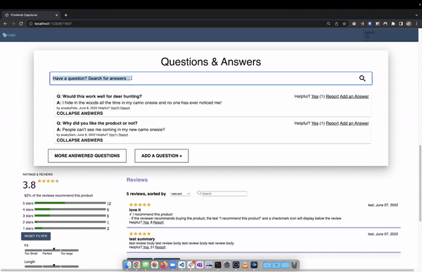
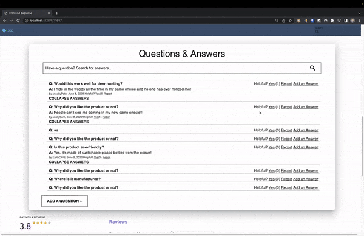
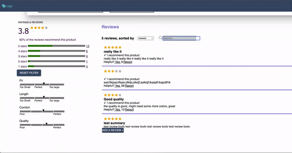
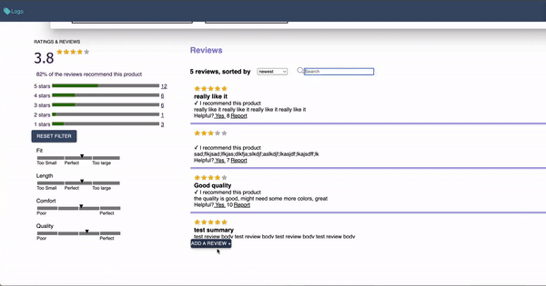

# Front End Capstone

An ecommerce application built with React to showcase a simple, modern and easy to navigate user interface.
Includes common retail shopping features such as search, browse, add to cart, create reviews, ask product questions and checkout. Interacts with Atelier API to obtain product data, styles, related items, questions, and reviews.

## Features & Usage

-  Components are lazy loaded and not rendered until they enter viewport to improve optimization
-  View different products and navigate to individual product pages by clicking on product name on home page
-  Toggle between different styles for each product by clicking on individual style image
-  Click on main image to view image in an expanded view mode
-  Once in expanded view mode, click image again to zoom into specific area of image, and watch image move around as you drag your cursor
-  Choose size and quantity from drop down menus then submit the form to sent request to server to add the item to the users cart

## Demo








## Tech Stack

This project was built with the following technologies:


## Setup/ Installation

-  Clone this repository and navigate to project directory in the terminal
-  Install necessary dependencies:

```bash
npm install
```

-  Obtain [Github](https://github.com/) API key and then create .env file (view sample.env in root directory for template):

```env
GITHUB_API_TOKEN=enter-api-token-here

```

-If using dev server, change NODE_ENV in .env to:

```env
NODE_ENV=development

```

Otherwise, set NODE_ENV like so for production:

```env
NODE_ENV=production

```

-  Then, if environment is set to development, run the application like so:

```bash
npm run dev
```

This opens a development server in your local browser at port 3000.

-  When application is ready for production, have webpack build your bundle and minimize your files:

```bash
npm start
```

Then navigate to port 8080 in your browser to view your application.

If you are seeing errors with your node.js server, try killing all nodemon servers:

```bash
pkill -f nodemon
```

-Run unit tests with Jest/React Testing Library:

```bash
npm test
```

-Then run end to end tests with Cypress:

```bash
npm run cypress
```

## Collaborators

-  [Cristian Ordonez](https://github.com/cristianordonez)
-  [Tyler Nourse](https://github.com/Nourse41)
-  [Shengnan Huang](https://github.com/maomaotuo)

## Resources

-  [Original group repository](https://github.com/rpp35-fec-http/fec-capstone)
-  [React code-splitting](https://reactjs.org/docs/code-splitting.html)
-  [Intersection Observer API](https://developer.mozilla.org/en-US/docs/Web/API/Intersection_Observer_API)
-  [Material UI](https://mui.com/)
-  [SVG Animations](https://css-tricks.com/guide-svg-animations-smil/)
-  [Creating .env files](https://github.com/motdotla/dotenv)
-  [React Testing Library](https://testing-library.com/docs/react-testing-library/intro/)
-  [Webpack Development/Production Configurations](https://webpack.js.org/configuration/mode/)
-  [HTML Webpack Plugin](https://webpack.js.org/plugins/html-webpack-plugin/)
-  [Jest](https://jestjs.io/docs/getting-started)
-  [Express Compression Middleware](http://expressjs.com/en/resources/middleware/compression.html)
-  [Cypress](https://go.cypress.io/get-started?utm_adgroup=132501525000&utm_keyword=cypress&utm_source=google&utm_medium=cpc&utm_campaign=15312994475&utm_term=cypress&hsa_acc=8898574980&hsa_cam=15312994475&hsa_grp=132501525000&hsa_ad=562694869893&hsa_src=g&hsa_tgt=kwd-40454352&hsa_kw=cypress&hsa_mt=e&hsa_net=adwords&hsa_ver=3&gclid=CjwKCAjwtIaVBhBkEiwAsr7-cxp_LMnmsukoi5fL7cCTNGQj5cTxhBWUQWoM3FhUPh6EeIGzCC6_EBoCpREQAvD_BwE)
